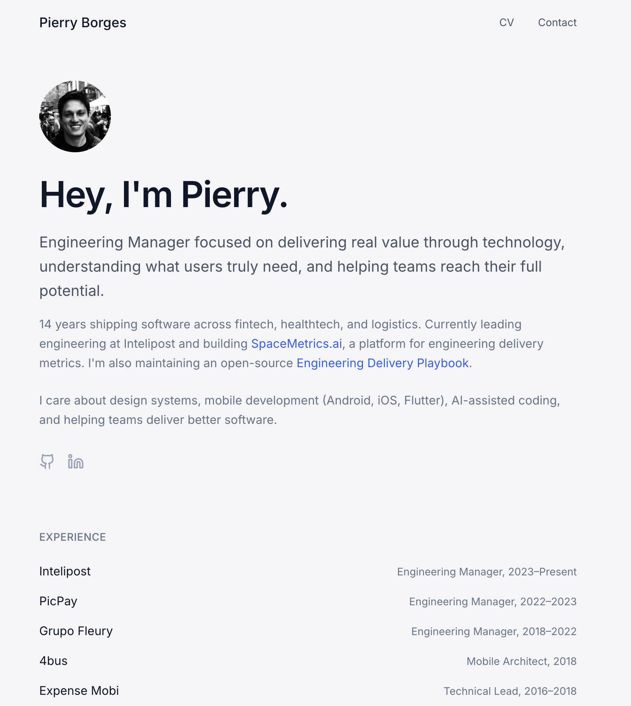

<p align="center">
  
</p>

<h1 align="center">pierry.github.io</h1>

<p align="center">
  My personal website. Minimalist, focused, built with React.
</p>

<p align="center">
  <a href="https://pierry.github.io">Live Site</a> •
  <a href="#tech-stack">Tech Stack</a> •
  <a href="#running-locally">Running Locally</a> •
  <a href="#license">License</a>
</p>

---

## About

A single-page personal website inspired by [Joel Becker's](https://www.joelb.dev/) minimalist academic portfolio style. Cloud dance background, Inter typography, and content that matters.

**Sections:**
- Introduction with profile photo
- Experience history
- Current projects
- Recommended links

## Tech Stack

| Category | Technology |
|----------|------------|
| Framework | React 18 |
| Language | TypeScript |
| Styling | Tailwind CSS |
| Font | Inter (Google Fonts) |
| Build | Vite |
| Hosting | GitHub Pages |

## Running Locally

```bash
# Clone
git clone https://github.com/Pierry/pierry.github.io.git
cd pierry.github.io

# Install
npm install

# Run
npm run dev
```

Open [http://localhost:5173](http://localhost:5173)

## Project Structure

```
src/
├── pages/
│   └── Index.tsx      # Main page
├── articles/          # Markdown articles (if any)
├── components/        # UI components
└── index.css          # Global styles + theme
public/
├── profile.jpg        # Profile photo
└── cv.pdf             # Resume
```

## Deployment

Automatic deployment via GitHub Actions on push to `master`:

1. Builds production bundle
2. Deploys to GitHub Pages

Manual build:
```bash
npm run build
```

## Contact

- **Email:** pieerry@gmail.com
- **LinkedIn:** [pierryborges](https://linkedin.com/in/pierryborges)
- **GitHub:** [@Pierry](https://github.com/Pierry)

## License

MIT
